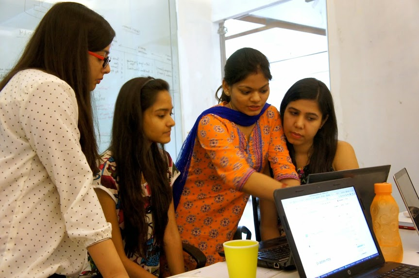

Pyladies Meetup
===============

:date: 2014-06-27
:author: Rituparna Panda
:author_gravatar: https://secure.gravatar.com/avatar/ae41f3e136bbd391562510f7d53f0282?s=100
:summary: First NCR Pyladies Meetup

I heard about women coding, women python programmers meetup , hackathons etc
a lot, but apparently everything happened in the western world. I was keen to
find out women developers here in India. On June 14th, 2014 - 4 women
(out of them 3 were python developers) finally met for the first time
at Noida for Pyladies Meetup. 

*Yay we made it* :-)

On our first Meetup, we discussed about:

* Each others interest
* Setting up a new project and Github repository
* Introduction of virtual environment and Python
* And agenda for next Meetup

It was very exciting, meeting and talking about our challenges and issues.
I called some of my male colleagues to help us and they were very positive
and enthusiastic while helping us.

We planned to meet every month atleast once and learn coding together. If
anyone is interested, then please follow us on
`Meetup.com <http://www.meetup.com/PyladiesIndia/>`_
and know more about our upcoming meetup.
